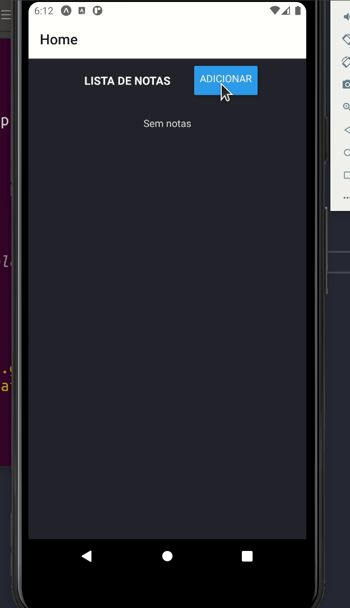

Universidade Federal do Paraná - UFPR
Setor de Educação Profissional e Tecnológica - SEPT
Tecnologia em Análise e Desenvolvimento de Sistemas
DS151 - Desenvolvimento para Dispositivos Móveis
Prof. Dr. Alexander Kutzke

##### GRR20175466 - Amanda Regina de Oliveira Mazurok

---

# Atividade Notas

Construção de aplicação que realiza um CRUD (criar, alterar, ler e remover) de notas, utilizando Expo, React Navigation configurado em navegação do tipo Stack e os Hooks useReducer e useContext para compartilhar dados entre as telas.  

Na aplicação é possível:

- Adicionar uma nova nota com título e texto;
- Editar o título e o texto de nota existente;
- Apagar a nota.

Exemplo de funcionamento:




```bash
$ npm install     # download e instalacao
$ expo start       # run
```

